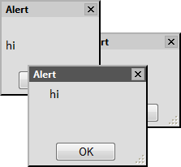
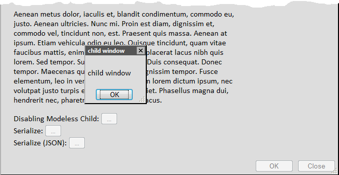

#### *Rough HTML-to-Markdown conversion*

This README.md file is a direct automated conversion of
index.html to Markdown format. As such, it will have several
inconsistencies, formatting issues, and missing images.

This project was an effort that shortly preceded jQuery UI,
back when jQuery itself was relatively new, and plugins were
the cool thing to produce and contribute to the Javascript
community. jqDialogForms was essentially a modal dialog
plugin with forms input support, so the idea / user story was, 
in VB6-like UI style, a user might click a button, get a 
pop-over "window" (really a floating div), fill out a form, 
hit "OK", and it might use jQuery AJAX to submit the form in 
that "window" and the "window" would close. All inline on the 
page.

----

# jqDialogForms

Submit bug reports and suggestions at jQuery.com: [http://plugins.jquery.com/project/jqDialogForms](http://plugins.jquery.com/project/jqDialogForms)

*   [About jqDialogForms](#About)
*   [How To Use](#HowToUse)
*   [Demo](#Demo)
*   [Options](#Options)
*   [Download](#Download)

jqDialogForms is a Javascript library based on jQuery that was built for producing windowed forms using strictly dynamic HTML. The inspiration comes from the development workflow of Visual Basic "Forms" and .NET Windows Forms, combined with the utility of HTML <form>'s and jQuery's serialize().

Features:

*   Modeless+parent disabling+serializeable dialog form windows  

*   Reference a DOM element or a string of HTML as the message or form fields to be displayed
*   Automatically switch from fixed positioning to absolute positioning when in quirks mode IE7, and position to the current vertical scroll position
*   jqDnR enabled: Resizeable, Windows 9x style
*   jqDnR enabled: Drag around the screen via the title bar
*   Activateable; show multiple windows, and activate/focus each window as it is clicked on (Windows 9x application windows activation behavior)
*   Lacking CSS conformance of a dialog window container, a prefab one is used that includes a title bar, a close box, and OK/Cancel buttons.
*   OK button invokes Apply event handler and then, if not invalidated, closes the window.
*   Dirty state detection; on editable forms, OK/Apply buttons are disabled unless a field is changed
*   Exposes form serialize functions that outputs name/value HTML/querystring encoding (in the style of jQuery serialize()), or JSON serialization.
*   "Smart" top positioning for oversized dialogs
*   CSS-driven layout

Among the several known issues:

*   Multiple windows do not retain their activation order.
*   No modal dialog or truly modeless (non-disabling) support
*   <strike>No demo</strike> No extensive demo
*   No documentation  

A few months back I released a Javascript library called [jqAlert](http://www.jondavis.net/codeprojects/jqalert/). I will probably rewrite jqAlert to use jqDialogForms.

It's NOT perfect, there are a few missing parts and pieces, but as far as I know it's a stable beta and can probably be used in production environments (I think).

Unlike normal jQuery plug-ins, jqDialogForms is only _dependent upon_ jQuery, it does not _attach to_ jQuery.

To use jqDialogForms, you must instantiate a new DialogWindow object with your options, pass a function callback to its `apply()` event, and then invoke its `show()` function.

Here is the constructor signature for the DialogWindow object:

> <pre>var DialogWindow = function(optional_message, optional_options, optional_parentWindow) { ... }</pre>

For example,

    var msg = 'Greetings.';
    var myWindow = new DialogWindow(msg, {title: 'Enter your name'});
    myWindow.show();
    
* * *

> <pre>var msg = '
Please enter your name.

<input name="your_name" style="width: 250px" />
';
> var myWindow = new DialogWindow(msg, {title: 'Enter your name'});
> myWindow.el.style.width = '300px';
> myWindow.beforeShow(function() { alert('beforeShow'); });
> myWindow.show(function() { alert('showing'); });
> myWindow.apply(function() { alert('applying: ' + myWindow.serialize(true)); });
> myWindow.show();
>             </pre>

### Alert

This sample demonstrates the simplest form of a dialog.

    <button type="button" id="demo_alert" onclick="(new DialogWindow('Hi.')).show();">Alert</button>  

* * *

### Multiple Forms & Activation

This sample displays multiple dialog windows. Click on the titlebar, message text, or gray space of each one to "activate" it.

    
	<button type="button" id="demo_multiact" onclick="demo_multiact()">Multiple windows and activation/selection</button>
	
* * *

### 'Apply' Handler

Demonstrates the automatic detection of changes to form fields, followed by the manual handling of the 'Apply' event, which is raised when the OK button or the Apply button is clicked. (OK=Apply+Close.)

    
	<button type="button" id="demo_apply_handler" onclick="demo_apply_handler()">'Apply' Handler</button>
	
* * *

### Parent/Child Window Ownership

Demonstrates a parent's "ownership" of a child window, forcing the child window to stay on top of the parent window.

    
		<button type="button" onclick="demo_parent_child()">Parent/Child</button>  

* * *

### Parent/Child Window Ownership With Parent Fields Blocking

Demonstrates a parent's "ownership" of a child window, forcing the child window to stay on top of the parent window, and blocking the parent's input fields until the child window is closed.

     <button type="button" onclick="demo_parent_child_field_blocking()">Parent/Child (blocking)</button>  

* * *

### DOM Element => HTML

This sample shows how the HTML of a DOM element can be used for the content body.

     <button type="button" onclick="demo_domhtml()">DOM Referenced Dialog</button>  

* * *

### DOM Element (direct)

This sample shows how a DOM element can be directly used for the content body. _Note: Once consumed, it is destroyed with the window._

    
	<button type="button" onclick="demo_dom()">DOM Referenced Dialog</button>  

* * *

### Form Serialization

This sample demonstrates the two types of form serialization: default encoding and JSON.

    
	<button type="button" onclick="demo_domserialize()">DOM Referenced Dialog</button>  

The default options ...

    DialogWindow.DefaultOptions = {

        containerWindowElement: null,

        reuseElement: false,        // set to true to use the element object rather 
                                    // than its HTML

        title: 'Dialog',            // the text for dialogTitle element

        top: 'middle',              // set to pixels or to 'middle'

        left: 'center',             // set to pixels or to 'center'

        css: {                      // injected to the dialogWindow element
            position: 'fixed',
            minWidth: '120px'
        },

        iconUrl: '',                // if set, adds an image to dialogIcon element

        modal: false,               // can be false (normal), true (page blocking -- not yet implemented), 
                                    //      'modeless' (takes Z-Index of parent), or 
                                    //      'parent' (like 'modeless' but also block 
                                    //      parent's message and buttons)
        showAnimate: null,          // function; callback function that uses jQuery

                                    //      animate options structure, w/ added 
                                    //      props: speed, easing, callback

        hideAnimate: null,          // function; callback function for performing an 
                                    //      animation after closing a form

        hideOkCancelButtons: false, // hide the element that contains the OK / Apply 
                                    //      / Cancel buttons

        hideOkButton: false,        // hide the OK button

        hideApplyButton: true,      // hide the Apply button

        hideCancelButton: true,     // hide the Cancel button

        allowResize: true,          // enable jqDnR for resizing

        okText: 'OK',               // the text to be displayed on the OK button

        applyText: 'Apply',         // the text to be displayed on the Apply button

        cancelText: 'Cancel'        // the text to be displayed on the Cancel button
    };

